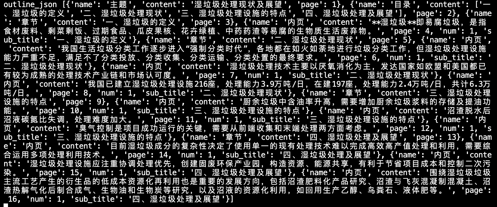

# 基于chatglm3-6b的ppt大纲及详情内容生成
## 简介
- 基于chatglm3-6b模型，在用户输入ppt主题、参考文档后，生成ppt大纲，并对ppt大纲切分后，基于RAG检索增强生成ppt详情
- 模型服务：使用fastapi部署openai格式的大模型服务
- 向量模型：bge-large-zh-v1.5
- 向量库：Faiss
## 使用fastapi部署openai格式的大模型服务
- 借鉴chatglm3官方示例：https://github.com/THUDM/ChatGLM3/blob/main/openai_api_demo/api_server.py
- 基于modelscope下载chatglm3-6b模型权重，代码见`download_model.py`
- 环境搭建
```
cd openai_api_server
sh install.sh
```
- 启动大模型服务
```
cd openai_api_server
sh start.sh
```
## 基于gradio，ppt大纲及详情内容生成应用
### 服务部署
```
cd gradio_demo
python gradio_demo.py
```
- web终端打开`http://0.0.0.0:6006/`，即可访问
- 注意：`gradio_demo/document2vec.py`需要传入`bge-large-zh-v1.5`向量模型的存储路径
### 应用逻辑
- 基于gradio实现了用户输入ppt主题，或者输入参考材料/上传参考文档的方式生成markdown格式的ppt大纲，以及json格式的ppt详情
  - 如果用户仅输入ppt主题，则仅通过ppt主题生成大纲以及详情
  - 如果用户输入ppt主题后，还输入参考材料，或者上传参考文档，则会基于ppt主题以及参考文本生成ppt大纲，再通过RAG生成ppt详情
- ppt大纲生成
  - 用户仅输入ppt主题，则直接调用大模型进行ppt大纲生成
  - 用户输入ppt主题以及参考材料，如果拼接后的prompt长度超过max_token_length，则需要对参考材料使用大模型进行总结，总结后再重新拼接为prompt，传给大模型进行ppt大纲生成
  - 生成的ppt大纲为markdown格式，使用gradio.Markdown进行渲染
- ppt详情生成
  - 对上一步生成的ppt大纲，使用`markdown_to_json`库切分为json格式，具体代码见`gradio_demo/utils.py`中的`split_sub_outline`方法，切分示例如下
  
  - 逐一遍历outline_json，生成ppt详情
    - 其中，对于主标题、目录、章节页这三类，不需要调用大模型生成详情
    - 对于内页类型，则需要调用大模型进行详情生成
      - 其中，对于没有传入参考材料，则直接生成详情
      - 对于存在传入参考材料，则基于RAG生成详情
  - RAG生成ppt详情步骤
    - 将传入的参考材料，基于`langchian-chatchat`中的`ChineseRecursiveTextSplitter`方法进行文本切分，代码见`gradio_demo/chinese_recursive_text_splitter.py`
    - 基于langchain的`HuggingFaceBgeEmbeddings`方法，加载`bge-large-zh-v1.5`向量模型，对切分后的文本进行向量化，并存入faiss向量库中，代码见`document2vec.py`
    - 对于每个ppt内页大纲内容，调用faiss的`similarity_search_with_score`方法，召回最接近的文本
    - 对于向量召回的文本，再次调用大模型进行二次召回
    - 将二次召回的文本，以及大纲封装为prompt，调用大模型进行详情生成
  - 对生成的ppt详情，基于`markdown_to_json`库切分为json格式，具体代码见`gradio_demo/split_ppt_detail.py`
  - 将json格式的ppt详情使用gradio.Json进行渲染
### 生成示例
- ppt标题示例：湿垃圾处理现状及展望
- 参考材料示例：`data/湿垃圾处理现状及展望.txt`
- 生成结果
 
- ppt详情json格式文件：`data/湿垃圾处理现状及展望.json`
## 迭代方向
- 对大模型进行markdown生成数据格式的微调，现有模型生成的markdown还存在一定问题
- 对ppt详情生成的json文件进行抽取，基于python-pptx进行ppt内容插槽，生成完整的ppt文件
